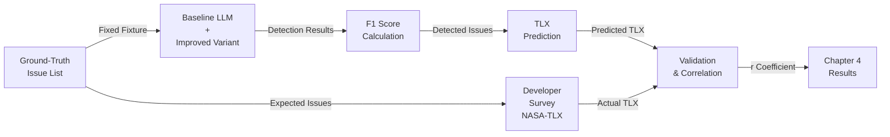

# NASA-TLX: Cognitive Load & Accessibility Workload Assessment

## Overview

This directory contains **educational materials** and **executable tools** for understanding and implementing NASA-TLX (NASA Task Load Index) cognitive workload assessment in the context of accessibility barriers.

**Purpose**: Support dissertation Chapter 4 analysis correlating LLM detection accuracy (F1 metrics) with developer-reported cognitive workload.

---

## Directory Structure

```
NASA-TLX/
├── README.md                              # This file
├── Overview & Learning Materials
│   ├── nasa-tlx-overview.md               # What is NASA-TLX? 6 subscales explained
│   ├── nasa-tlx-dimensions-and-anchors.md # Detailed anchor definitions (0, 50, 100 points)
│   └── nasa-tlx-visual-ui-detailed-guide.md  # How to use NASA-TLX survey UI
│
├── Accessibility-Specific Content
│   ├── cognitive-load-nasa-tlx-and-accessibility.md  # Mapping barriers → workload
│   ├── nasa-tlx-accessibility-mapping.md  # Barrier-to-dimension matrix
│   │
│   └── LLM Prediction Protocol
│       ├── nasa-tlx-llm-prediction-guide.md        # How LLM predicts TLX
│       ├── nasa-tlx-llm-prediction-protocol.md     # Exact prompts & procedure
│       └── nasa-tlx-coding-detailed-guide.md       # Manual coding & scoring
│
├── Scoring & Protocols
│   └── nasa-tlx-scoring-and-confidence.md # Raw TLX calculation & confidence levels
│
└── Executable Test Framework
    └── test-harness/                      # ← Run tests here
        ├── README.md                      # Quick start guide
        ├── nasa-tlx-test-harness.ts       # Core prediction model
        ├── test-runner.ts                 # Test suite entry point
        ├── IMPLEMENTATION_GUIDE.md        # Detailed model explanation
        ├── package.json                   # Dependencies
        ├── tsconfig.json                  # TypeScript config
        └── src/                           # (npm run build outputs to dist/)
```

---

## Quick Navigation

### 📚 For Understanding NASA-TLX
**Start here if you're new to workload assessment:**
1. [nasa-tlx-overview.md](./nasa-tlx-overview.md) — What is NASA-TLX?
2. [nasa-tlx-dimensions-and-anchors.md](./nasa-tlx-dimensions-and-anchors.md) — Six dimensions explained
3. [nasa-tlx-visual-ui-detailed-guide.md](./nasa-tlx-visual-ui-detailed-guide.md) — How surveys work

### 🧠 For Accessibility Context
**Understanding barriers → workload mapping:**
1. [cognitive-load-nasa-tlx-and-accessibility.md](./cognitive-load-nasa-tlx-and-accessibility.md) — Why accessibility affects workload
2. [nasa-tlx-accessibility-mapping.md](./nasa-tlx-accessibility-mapping.md) — Specific barrier impacts

### 🤖 For LLM Implementation
**Predicting TLX from detected issues:**
1. [nasa-tlx-llm-prediction-guide.md](./nasa-tlx-llm-prediction-guide.md) — Model overview
2. [nasa-tlx-llm-prediction-protocol.md](./nasa-tlx-llm-prediction-protocol.md) — Exact prompts
3. [test-harness/IMPLEMENTATION_GUIDE.md](./test-harness/IMPLEMENTATION_GUIDE.md) — Code deep dive

### 🧪 For Running Tests
**Validate the prediction model:**
```bash
cd test-harness
npm install
npm test
```
See [test-harness/README.md](./test-harness/README.md) for details.

---

## Key Concepts

### NASA-TLX: Six Workload Dimensions

| Dimension | Meaning | A11y Example |
|-----------|---------|--------------|
| **Mental Demand (MD)** | Cognitive effort, problem-solving | Understanding complex ARIA semantics |
| **Physical Demand (PD)** | Motor control, hand-eye coordination | Keyboard navigation complexity |
| **Temporal Demand (TD)** | Time pressure, pacing | Completing task despite navigation issues |
| **Performance (Perf)** | Perceived success rate | Confidence in identifying all issues |
| **Effort (E)** | How hard you had to work | Cognitive/physical strain to complete |
| **Frustration (F)** | Irritation, discouragement, stress | Reaction to unexpected behavior |

### Raw TLX Score Calculation
```
Raw TLX = (MD + PD + TD + (100 - Perf) + E + F) / 6

Range: 0–100 (0 = effortless, 100 = overwhelming)
```

### 10 Accessibility Barriers & Their Impacts

| Barrier | Key Dimensions | Why It Matters |
|---------|---|------|
| Missing Labels | MD ↑ | Must infer purpose of controls |
| Keyboard Traps | E ↑ F ↑ | Requires workarounds; frustrating |
| Poor Focus Visibility | MD ↑ F ↑ | Visual search burden |
| Low Contrast | MD ↑ E ↑ | Physical/visual strain |
| Unclear Errors | F ↑↑ | Cannot remediate problems |
| Cluttered Layout | MD ↑ | Complex cognitive parsing |
| Dynamic Updates | MD ↑ TD ↑ | Constant re-evaluation + time pressure |
| ARIA Errors | MD ↑ F ↑ | Semantic confusion |
| Focus Trap | TD ↑ F ↑ | Stuck; time pressure |
| Missing Skip Links | TD ↑ E ↑ | Repetitive navigation overhead |

See [test-harness/IMPLEMENTATION_GUIDE.md](./test-harness/IMPLEMENTATION_GUIDE.md) for detailed impact weights.

---

## Workflow: Chapter 4 Analysis

### Goal
Validate correlation between **F1 detection accuracy** and **Developer Cognitive Workload**:

> "As the LLM detects more issues correctly (F1 ↑), developer workload decreases (TLX ↓)."

### Data Pipeline


### Step-by-Step
1. **Ground Truth**: Define accessibility issues in test fixture (pre-annotated)
2. **Baseline Detection**: Run baseline LLM on fixture → list of issues
3. **F1 Calculation**: `F1 = 2(Precision × Recall) / (Precision + Recall)`
4. **TLX Prediction**: `predictTlxFromIssues(detected_issues)` → workload score
5. **Developer Rating**: Collect NASA-TLX survey responses (mock or real)
6. **Correlation**: Compute `Pearson r(F1, |TLX_error|)` across test set
7. **Report**: Visualize correlation for Chapter 4

### Expected Results
- **Strong positive correlation** (r > 0.7): Model validates (better detection → lower error)
- **Weak correlation** (r < 0.5): Barrier weights need recalibration
- **Negative correlation**: Model assumption violated (investigate)

---

## Files Explained

### 📖 Educational Materials

| File | Purpose | Read When |
|------|---------|-----------|
| **nasa-tlx-overview.md** | What is NASA-TLX? History, origins, use cases | Starting out |
| **nasa-tlx-dimensions-and-anchors.md** | Detailed explanation of 6 subscales with anchor examples | Understanding scales |
| **nasa-tlx-visual-ui-detailed-guide.md** | How survey UI works, rating process | Planning survey |
| **cognitive-load-nasa-tlx-and-accessibility.md** | Why accessibility affects workload; conceptual mapping | Dissertation context |
| **nasa-tlx-accessibility-mapping.md** | Specific barriers mapped to dimensions with weights | Model implementation |
| **nasa-tlx-llm-prediction-guide.md** | How LLM predicts TLX from detected issues | LLM integration |
| **nasa-tlx-llm-prediction-protocol.md** | Exact prompts, few-shot examples, procedure | Reproducibility |
| **nasa-tlx-coding-detailed-guide.md** | Manual coding if doing human annotation | Validation |
| **nasa-tlx-scoring-and-confidence.md** | Raw TLX calculation, confidence intervals | Scoring phase |

### 💻 Executable Tools

| File | Purpose | Run With |
|------|---------|----------|
| **test-harness/nasa-tlx-test-harness.ts** | Core prediction model, barrier mapping, types | Part of test suite |
| **test-harness/test-runner.ts** | Entry point; runs 4 test scenarios | `npm test` |
| **test-harness/IMPLEMENTATION_GUIDE.md** | Deep dive into model logic and assumptions | Reading reference |
| **test-harness/package.json** | Dependencies (TypeScript, ts-node) | `npm install` |
| **test-harness/tsconfig.json** | TypeScript compiler config | Auto-used by tsc |

---

## Running the Test Harness

### Prerequisites
- Node.js 14+ and npm installed
- TypeScript knowledge (optional; use ts-node to run .ts directly)

### Install & Run
```bash
cd evaluation/NASA-TLX/test-harness
npm install
npm test
```

### What Happens
1. Test runner loads 4 realistic fixtures (0 → 8 accessibility issues)
2. Predicts TLX for each fixture using barrier mapping model
3. Validates predictions against expected workload ranges
4. Generates summary report with pass/fail status

### Expected Output
```
Test: Clean HTML (no issues)
  Predicted TLX: 8/100 (expected 0–15)
  Result: ✓ PASS

Test: High accessibility barriers (8 critical/high issues)
  Predicted TLX: 58/100 (expected 50–85)
  Actual TLX (mock): 67/100
  Error margin: ±9 points
  Validation: accurate
  Result: ✓ PASS

Pass Rate: 100.0%
```

---

## Using This for Chapter 4

### Phase 1: Model Validation (Current)
- ✓ Barrier mapping defined
- ✓ Test harness implemented
- ✓ Mock developer ratings in place
- **Goal**: Validate model predicts reasonable TLX scores

### Phase 2: Real Data Collection
- [ ] Recruit developer participants
- [ ] Prepare accessibility issue ground truth
- [ ] Collect NASA-TLX survey responses
- [ ] Compute F1 for baseline + improved LLM variant
- [ ] Run correlation analysis

### Phase 3: Report Generation
- [ ] Plot F1 vs TLX error (scatter plot)
- [ ] Compute Pearson r and confidence interval
- [ ] Interpret results for dissertation narrative
- [ ] Sensitivity analysis (vary barrier weights)

---

## Key Assumptions

1. **Issue titles are descriptive**: Classification relies on keyword matching. Quality improves with LLM pre-processing.

2. **Barriers are independent**: In reality, combinations (e.g., low contrast + poor focus) may interact non-linearly. Model applies logarithmic scaling to approximate this.

3. **Developer expertise is constant**: Model assumes consistent experience level. Personalization per skill level not yet implemented.

4. **Ground truth is comprehensive**: Model assumes all issues are detected/identified. Real workload includes issue-finding effort.

5. **No domain adaptation**: Barrier impacts calibrated to general accessibility. Specific applications (e.g., maps vs. documents) may differ significantly.

---

## Integration Points

### With Ground-Truth Issue Database
[evaluation/preset-benchmark/fixtures/](../preset-benchmark/) contains pre-annotated HTML fixtures with known accessibility issues. Use these for:
- Ground truth validation
- LLM baseline testing
- Reproducible test scenarios

### With Cloud-LLM Evaluation
[evaluation/Cloud-LLM-Preliminary/](../Cloud-LLM-Preliminary/) runs LLM detection on fixtures. Use output for:
- F1 score computation
- TLX prediction input
- Correlation analysis data

---

## FAQ

**Q: Can I run tests without real developer data?**  
A: Yes! Mock developer ratings are included (`EXAMPLE_MOCK_DEVELOPER_RATING`). Use for model validation. For actual correlation analysis, collect real survey data.

**Q: How do I adjust barrier impact weights?**  
A: Edit `BARRIER_MAPPING` in `test-harness/nasa-tlx-test-harness.ts`. Adjust dimension impact values (e.g., `mental_demand: 15`), save, and re-run tests.

**Q: What if predictions fall outside expected ranges?**  
A: Weights may need recalibration. Try:
1. Reducing high-impact barriers if predictions are too high
2. Increasing low-impact barriers if predictions are too low
3. Checking issue classification (keyword matching may misclassify)

**Q: Can I use this for other domains (not just accessibility)?**  
A: Yes! Modify `BARRIER_MAPPING` to define your domain's barriers and their impacts. The core prediction algorithm is domain-agnostic.

**Q: How confident is the model?**  
A: Confidence levels depend on issue count:
- **Low** (< 5 issues): Limited signal
- **Medium** (5–14 issues): Moderate signal
- **High** (15–50 issues): Strong signal
- Issues > 50 may be noise; confidence drops to medium

---

## Next Steps

1. **Review model assumptions** in [test-harness/IMPLEMENTATION_GUIDE.md](./test-harness/IMPLEMENTATION_GUIDE.md)
2. **Run test harness** to validate baseline predictions
3. **Prepare ground truth** fixtures for Phase 2
4. **Plan developer recruitment** for NASA-TLX survey
5. **Implement LLM classification** hook (replace keyword matching)

---

## References & External Resources

- **NASA-TLX Original Paper**: Hart & Staveland (1988). "Development of the NASA-TLX (Task Load Index)"
- **NASA-TLX Online Form**: https://humansystems.arc.nasa.gov/tlx/
- **WCAG 2.1 Guidelines**: https://www.w3.org/WAI/WCAG21/quickref/
- **Accessibility Cognitive Load**: Research on how barriers affect developer workload

---

## Dissertation Context

**Chapter 4: Quantitative Analysis**  
*Correlation Between LLM Detection Accuracy and Developer Cognitive Workload*

**Hypothesis**:  
> "Improved accuracy in barrier detection (higher F1 scores) correlates with reduced developer cognitive workload (lower NASA-TLX scores), supporting the hypothesis that better-informed accessibility guidance decreases developer burden."

**Method**:
- Baseline LLM vs. improved variant (with RAG/reasoning)
- Detection accuracy (F1) computed per fixture
- Developer TLX ratings collected for same fixtures
- Pearson correlation analysis with confidence intervals

**Expected Impact**:
- Quantifies utility of improved LLM: "X% more accurate detection → Y% lower workload"
- Validates NASA-TLX as proxy metric for developer experience
- Supports scaling arguments for AI accessibility assistance

---

**Last Updated**: 2026  
**Status**: Phase 1 complete (model validation). Ready for Phase 2 (data collection).
