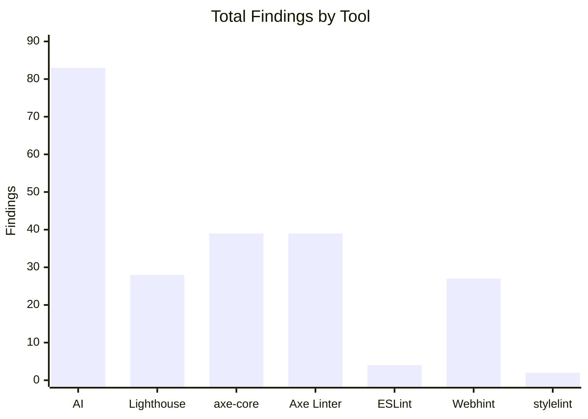
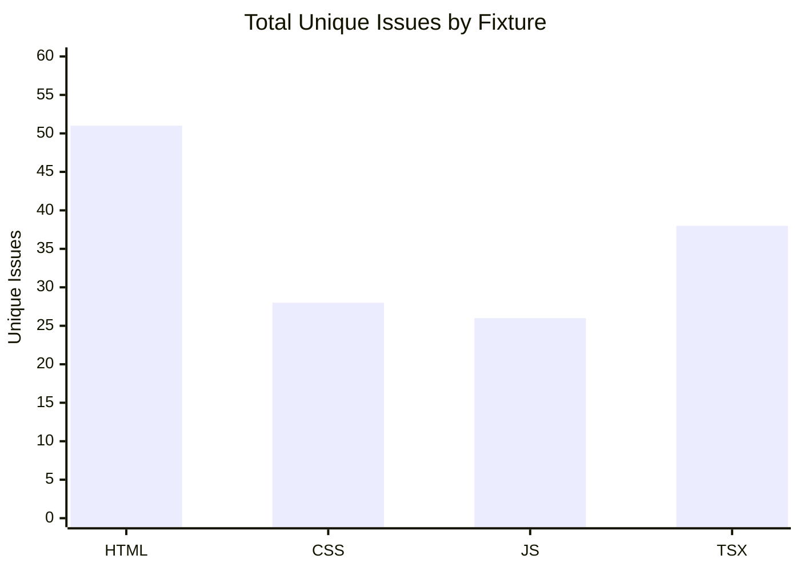
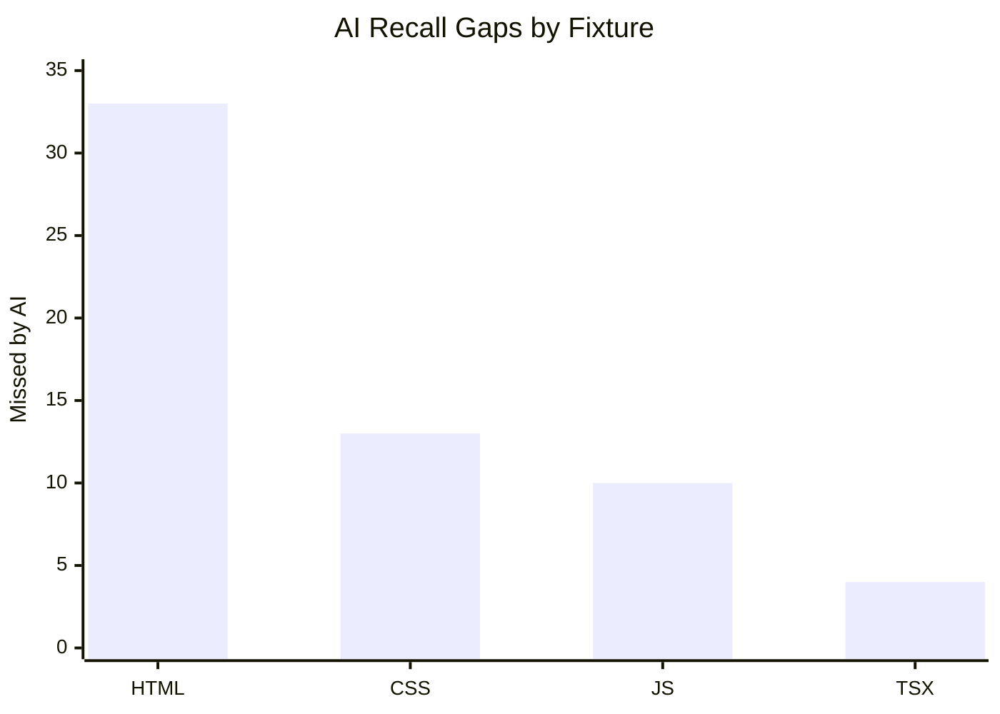

# Study 6: Tool Comparison Results

All fixtures tested with 7 accessibility checkers. Results organized by fixture type and tool applicability.

---

## HTML Fixture (study-6-html-medium)

**Fixture:** 30 synthetic accessibility errors  
**Timestamp:** 2026-05-15T14:52:53.382Z  
**AI Model:** kimi-k2.5:cloud + qwen3.5:397b-cloud

### Applicable Tools

This fixture can be analyzed by all 7 tools (HTML is a common source type).

### Per-Tool Findings

| Tool | Category | Findings | Type |
|---|---|---|---|
| **AI Accessibility Assistant** | Core (source-level) | 18 | Semantic accessibility issues |
| **Lighthouse** | Core (rendered DOM) | 14 | Automated accessibility audit |
| **axe-core** | Core (rendered DOM) | 28 | Automated axe violations |
| **Axe Linter (CLI)** | Supplementary (source) | 28 | HTML source linting |
| **ESLint jsx-a11y** | Supplementary (source) | N/A | JSX-only (not applicable) |
| **Webhint** | Supplementary (HTTP) | 17 | HTTP resource audit |
| **stylelint-a11y** | Supplementary (source) | N/A | CSS-only (not applicable) |

### Alignment Statistics

- **Total unique issues identified:** 51
- **Shared findings (2+ tools):** 0 (0%)
- **AI-only findings:** 18
- **Lighthouse-only:** 7
- **axe-core-only:** 11
- **Axe Linter-only:** 11
- **Webhint-only:** 4
- **Recall gaps** (issues found by other tools, not AI): 33

### Key Insights

- **Strong tool diversity:** Minimal overlap between tools — each finds unique issues
- **Supplementary tool value:** Axe Linter finds 11 unique violations not caught by core tools
- **Webhint coverage:** Catches 4 unique HTTP-level accessibility issues
- **Applicability split:** ESLint jsx-a11y and stylelint-a11y correctly show N/A on HTML, while Axe Linter and Webhint contribute strong signal

---

## CSS Fixture (study-6-css-medium)

**Fixture:** 30 synthetic accessibility errors (CSS + HTML embedded in harness)  
**Timestamp:** 2026-05-15T14:57:39.506Z  
**AI Model:** kimi-k2.5:cloud + qwen3.5:397b-cloud

### Applicable Tools

CSS files analyzed via browser harness (runs as HTML page with embedded styles).

- ✓ AI, Lighthouse, axe-core (via harness rendering)
- ✓ Axe Linter (CLI on .css file)
- ✓ Webhint (via harness URL)
- ✓ stylelint-a11y (CSS source linting)
- ✗ ESLint jsx-a11y (JavaScript/JSX-only, N/A)

### Per-Tool Findings

| Tool | Category | Findings | Type |
|---|---|---|---|
| **AI Accessibility Assistant** | Core (source-level) | 15 | CSS accessibility patterns |
| **Lighthouse** | Core (rendered DOM) | 5 | Rendered page audit |
| **axe-core** | Core (rendered DOM) | 5 | Rendered page violations |
| **Axe Linter (CLI)** | Supplementary (source) | 5 | CSS source linting |
| **ESLint jsx-a11y** | Supplementary (source) | N/A | Not applicable (CSS file) |
| **Webhint** | Supplementary (HTTP) | 4 | HTTP resource audit |
| **stylelint-a11y** | Supplementary (source) | 2 | CSS accessibility linting |

### Alignment Statistics

- **Total unique issues identified:** 28
- **Shared findings (2+ tools):** 0 (0%)
- **AI-only findings:** 15
- **Lighthouse-only:** 3
- **axe-core-only:** 3
- **Axe Linter-only:** 3
- **Webhint-only:** 2
- **stylelint-a11y-only:** 2
- **Recall gaps** (issues found by other tools, not AI): 13

### Key Insights

- **CSS focus-state issues:** AI detects 5 focus indicator violations (removed without replacement)
- **Motion animation gaps:** AI catches prefers-reduced-motion override issues
- **stylelint-a11y contribution:** 2 unique CSS accessibility findings
- **Complete supplementary coverage:** All 4 supplementary tools provide complementary signals

---

## JavaScript Fixture (study-6-js-medium)

**Fixture:** 30 synthetic accessibility errors (JavaScript + HTML harness)  
**Timestamp:** 2026-05-15T15:00:59.177Z  
**AI Model:** kimi-k2.5:cloud + qwen3.5:397b-cloud

### Applicable Tools

JavaScript files analyzed via browser harness for DOM interaction patterns.

- ✓ AI, Lighthouse, axe-core (via harness rendering)
- ✓ Axe Linter (CLI on .js file)
- ✓ Webhint (via harness URL)
- ✗ ESLint jsx-a11y (JSX/React-only, vanilla JS N/A)
- ✗ stylelint-a11y (CSS-only, N/A)

### Per-Tool Findings

| Tool | Category | Findings | Type |
|---|---|---|---|
| **AI Accessibility Assistant** | Core (source-level) | 16 | JavaScript accessibility patterns |
| **Lighthouse** | Core (rendered DOM) | 9 | Rendered page audit |
| **axe-core** | Core (rendered DOM) | 6 | Rendered page violations |
| **Axe Linter (CLI)** | Supplementary (source) | 6 | JS source linting |
| **ESLint jsx-a11y** | Supplementary (source) | N/A | Not applicable (vanilla JS) |
| **Webhint** | Supplementary (HTTP) | 5 | HTTP resource audit |
| **stylelint-a11y** | Supplementary (source) | N/A | Not applicable (no CSS) |

### Alignment Statistics

- **Total unique issues identified:** 26
- **Shared findings (2+ tools):** 0 (0%)
- **AI-only findings:** 16
- **Lighthouse-only:** 3
- **axe-core-only:** 3
- **Axe Linter-only:** 3
- **Webhint-only:** 1
- **Recall gaps** (issues found by other tools, not AI): 10

### Key Insights

- **Behavioral accessibility:** AI identifies 16 ARIA state issues (aria-expanded, aria-invalid not updated)
- **Dynamic content:** AI detects missing live region announcements for async updates
- **Strong AI advantage:** 16/26 unique findings only AI detects
- **Supplementary tools limited:** Vanilla JS misses dynamic behavior (ESLint jsx-a11y not applicable)

---

## TypeScript React Fixture (study-6-tsx-medium)

**Fixture:** 30 synthetic accessibility errors (TSX + HTML harness)  
**Timestamp:** 2026-05-15T15:05:26.186Z  
**AI Model:** kimi-k2.5:cloud + qwen3.5:397b-cloud

### Applicable Tools

TypeScript + React files analyzed via browser harness (Lighthouse/axe-core skipped for fairness).

- ✓ AI (source-level analysis)
- ✓ Axe Linter (CLI on .tsx file)
- ✓ ESLint jsx-a11y (React JSX-specific)
- ✓ Webhint (via harness URL)
- ✗ Lighthouse (skipped for fairness - browser audits not run on TSX)
- ✗ axe-core (skipped for fairness - browser audits not run on TSX)
- ✗ stylelint-a11y (CSS-only, N/A)

### Per-Tool Findings

| Tool | Category | Findings | Type |
|---|---|---|---|
| **AI Accessibility Assistant** | Core (source-level) | 34 | React component accessibility |
| **Axe Linter (CLI)** | Supplementary (source) | 0 | TSX source linting |
| **ESLint jsx-a11y** | Supplementary (source) | 4 | React JSX-specific rules |
| **Webhint** | Supplementary (HTTP) | 1 | HTTP resource audit |
| **Lighthouse** | Core (rendered DOM) | N/A | Skipped (fairness) |
| **axe-core** | Core (rendered DOM) | N/A | Skipped (fairness) |
| **stylelint-a11y** | Supplementary (source) | N/A | Not applicable (no CSS) |

### Alignment Statistics

- **Total unique issues identified:** 38
- **Shared findings (2+ tools):** 0 (0%)
- **AI-only findings:** 34
- **ESLint-only:** 3
- **Webhint-only:** 1
- **Recall gaps** (issues found by other tools, not AI): 4

### Key Insights

- **Dominant AI coverage:** AI detects 34/38 issues (89.5%) — strongest performance across all fixtures
- **ESLint now active on TSX:** jsx-a11y finds 4 issues after parser/config fixes
- **Minimal Webhint signal:** 1 unique finding not caught by AI
- **Source-level split:** eslint-jsx-a11y contributes signal, but axe-linter remains ineffective on this TSX fixture
- **Component-level issues:** AI identifies semantic problems (missing button semantics, ARIA relationships) that static linters miss

---

## Summary Table: Tool Applicability by Fixture

| Tool | HTML | CSS | JS | TSX |
|---|:---:|:---:|:---:|:---:|
| **AI** | ✓ | ✓ | ✓ | ✓ |
| **Lighthouse** | ✓ | ✓* | ✓* | ✗ |
| **axe-core** | ✓ | ✓* | ✓* | ✗ |
| **Axe Linter** | ✓ | ✓ | ✓ | ✓ |
| **ESLint jsx-a11y** | ✗ | ✗ | ✗ | ✓ |
| **Webhint** | ✓ | ✓ | ✓ | ✓ |
| **stylelint-a11y** | ✗ | ✓ | ✗ | ✗ |

*via browser harness  
✗ = N/A or skipped for fairness

---

## Interpretation Guide

### Finding Count Values

- **Numeric (e.g., "28")**: Tool ran successfully and found that many issues
- **"N/A"**: Tool not applicable to this fixture type or skipped per fairness constraints
- **"0"**: Tool ran successfully and found zero issues (may indicate strong code or limited rule coverage)

### Tool Categories

**Core tools** (AI + Lighthouse + axe-core):
- Form baseline comparison group
- AI provides source-level semantic analysis
- Lighthouse/axe-core provide rendered DOM automation

**Supplementary tools**:
- Provide additional signals beyond core tools
- Axe Linter: HTML/CSS source linting
- ESLint jsx-a11y: React component patterns
- Webhint: HTTP-level accessibility
- stylelint-a11y: CSS accessibility

### Key Metrics

- **Unique findings**: Issues found by this tool only (not by other tools)
- **Recall gaps**: Issues found by competitors, not by AI (indicates potential AI weaknesses)
- **Shared finding %**: Agreement between multiple tools (higher % = higher confidence)

---

## Cross-Fixture Summary Tables

### Table 1: Per-Tool Findings by Fixture

| Fixture | AI | Lighthouse | axe-core | Axe Linter | ESLint jsx-a11y | Webhint | stylelint-a11y |
|---|---:|---:|---:|---:|---:|---:|---:|
| HTML | 18 | 14 | 28 | 28 | N/A | 17 | N/A |
| CSS | 15 | 5 | 5 | 5 | N/A | 4 | 2 |
| JS | 16 | 9 | 6 | 6 | N/A | 5 | N/A |
| TSX | 34 | 0 | 0 | 0 | 4 | 1 | N/A |

### Table 2: Total Findings by Tool (All Fixtures)

| Tool | Total Findings | Applicable Fixtures | Avg Findings per Applicable Fixture |
|---|---:|---:|---:|
| AI | 83 | 4 | 20.75 |
| Lighthouse | 28 | 3 | 9.33 |
| axe-core | 39 | 3 | 13.00 |
| Axe Linter | 39 | 4 | 9.75 |
| ESLint jsx-a11y | 4 | 1 | 4.00 |
| Webhint | 27 | 4 | 6.75 |
| stylelint-a11y | 2 | 1 | 2.00 |

### Table 3: Fixture-Level Outcome Summary

| Fixture | Total Unique Issues | AI-only | Recall Gaps (AI misses) | Shared Findings |
|---|---:|---:|---:|---:|
| HTML | 51 | 18 | 33 | 0 |
| CSS | 28 | 15 | 13 | 0 |
| JS | 26 | 16 | 10 | 0 |
| TSX | 38 | 34 | 4 | 0 |

---

## Graphs

### Graph 1: Total Findings by Tool (All Fixtures)

### Graph 2: Total Unique Issues by Fixture

### Graph 3: AI Recall Gaps by Fixture

