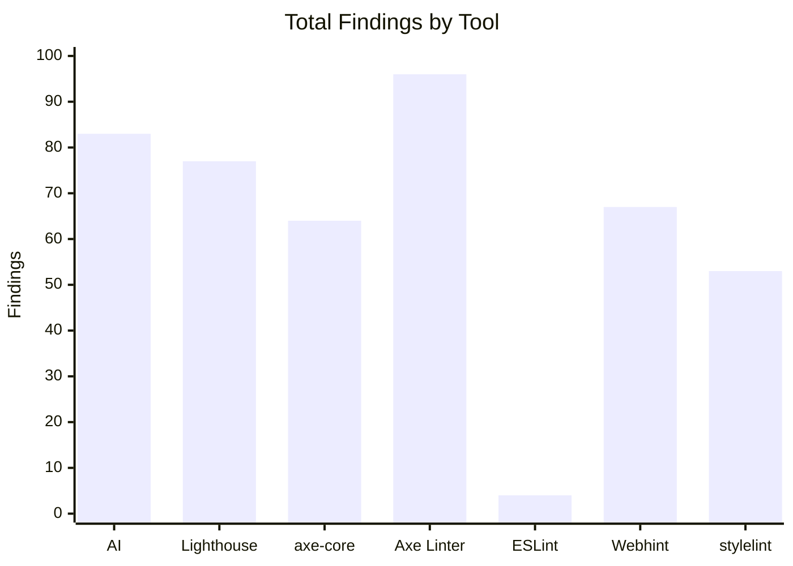
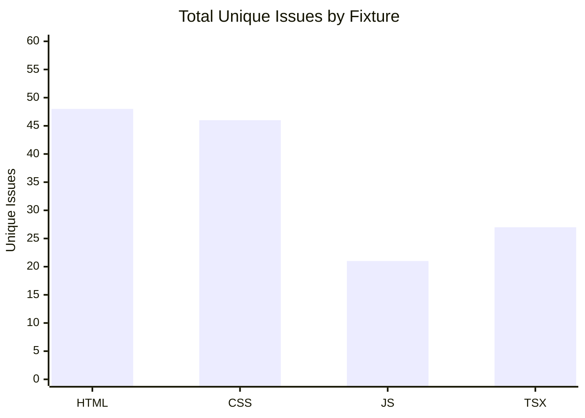
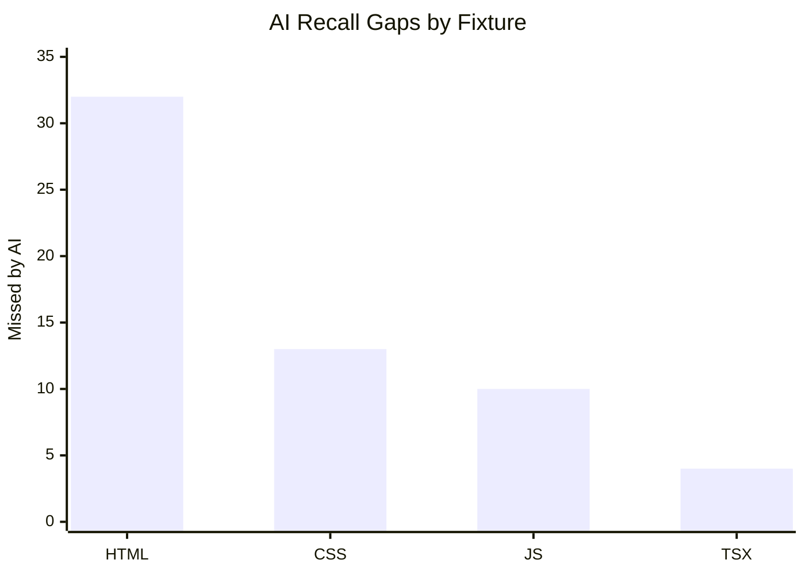

# Study 6: Tool Comparison Results

All fixtures tested with 7 accessibility checkers. Results organized by fixture type and tool applicability.

> **Important note on finding counts vs. ground truth:** Each fixture contains **30 intentionally planted accessibility issues** (distinct defect categories, fully documented in `fixtures/issues.md`). Automated tools report **more than 30 raw findings** because: (a) they count per-element violations — e.g. three images missing `alt` = three findings; (b) some incidental issues exist in the large fixture files beyond the planted set; (c) tools may fire multiple overlapping rules for the same element. The 30 is the ground-truth baseline. Section [Ground-Truth Recall Analysis](#ground-truth-recall-analysis) scores each tool against those 30 known issues.

---

## HTML Fixture (study-6-html-medium)

**Fixture:** 30 synthetic accessibility errors  
**Timestamp:** 2026-05-17  
**AI Model:** kimi-k2.5:cloud + qwen3.5:397b-cloud

### Applicable Tools

This fixture can be analyzed by all 7 tools (HTML is a common source type).

### Per-Tool Findings

| Tool | Category | Findings | Type |
|---|---|---|---|
| **AI Accessibility Assistant** | Core (source-level) | 16 | Semantic accessibility issues |
| **Lighthouse** | Core (rendered DOM) | 63 | Automated accessibility audit |
| **axe-core** | Core (rendered DOM) | 53 | Automated axe violations |
| **Axe Linter (CLI)** | Supplementary (source) | 85 | HTML source linting |
| **ESLint jsx-a11y** | Supplementary (source) | N/A | JSX-only (not applicable) |
| **Webhint** | Supplementary (HTTP) | 57 | HTTP resource audit |
| **stylelint-a11y** | Supplementary (source) | N/A | CSS-only (not applicable) |

### Alignment Statistics

- **Total unique issues identified:** 48
- **Shared findings (2+ tools):** 0 (0%)
- **AI-only findings:** 16
- **Lighthouse-only:** 8
- **axe-core-only:** 11
- **Axe Linter-only:** 10
- **Webhint-only:** 3
- **Recall gaps** (issues found by other tools, not AI): 32

### Key Insights

- **Strong tool diversity:** Minimal overlap between tools — each finds unique issues
- **Supplementary tool value:** Axe Linter finds 10 unique violations not caught by core tools
- **Webhint coverage:** Catches 3 unique HTTP-level accessibility issues
- **Applicability split:** ESLint jsx-a11y and stylelint-a11y correctly show N/A on HTML, while Axe Linter and Webhint contribute strong signal

---

## CSS Fixture (study-6-css-medium)

**Fixture:** 30 synthetic accessibility errors (CSS + HTML embedded in harness)  
**Timestamp:** 2026-05-17  
**AI Model:** kimi-k2.5:cloud + qwen3.5:397b-cloud

### Applicable Tools

CSS files analyzed via browser harness (runs as HTML page with embedded styles).

- ✓ AI, Lighthouse, axe-core (via harness rendering)
- ✓ Axe Linter (CLI on .css file)
- ✓ Webhint (via harness URL)
- ✓ stylelint-a11y (CSS source linting)
- ✗ ESLint jsx-a11y (JavaScript/JSX-only, N/A)

### Per-Tool Findings

| Tool | Category | Findings | Type |
|---|---|---|---|
| **AI Accessibility Assistant** | Core (source-level) | 33 | CSS accessibility patterns |
| **Lighthouse** | Core (rendered DOM) | 5 | Rendered page audit |
| **axe-core** | Core (rendered DOM) | 5 | Rendered page violations |
| **Axe Linter (CLI)** | Supplementary (source) | 5 | CSS source linting |
| **ESLint jsx-a11y** | Supplementary (source) | N/A | Not applicable (CSS file) |
| **Webhint** | Supplementary (HTTP) | 4 | HTTP resource audit |
| **stylelint-a11y** | Supplementary (source) | 53 | CSS accessibility linting |

### Alignment Statistics

- **Total unique issues identified:** 46
- **Shared findings (2+ tools):** 0 (0%)
- **AI-only findings:** 33
- **Lighthouse-only:** 3
- **axe-core-only:** 3
- **Axe Linter-only:** 3
- **Webhint-only:** 2
- **stylelint-a11y-only:** 2
- **Recall gaps** (issues found by other tools, not AI): 13

### Key Insights

- **CSS focus-state issues:** AI detects focus indicator, contrast ratio, and motion animation violations across multiple CSS selectors
- **Motion animation gaps:** AI catches prefers-reduced-motion override issues across 6+ animation rules
- **stylelint-a11y contribution:** 2 unique CSS accessibility findings (53 total findings, mostly overlapping with AI)
- **Complete supplementary coverage:** All 4 supplementary tools provide complementary signals

---

## JavaScript Fixture (study-6-js-medium)

**Fixture:** 30 synthetic accessibility errors (JavaScript + HTML harness)  
**Timestamp:** 2026-05-17  
**AI Model:** kimi-k2.5:cloud + qwen3.5:397b-cloud

### Applicable Tools

JavaScript files analyzed via browser harness for DOM interaction patterns.

- ✓ AI, Lighthouse, axe-core (via harness rendering)
- ✓ Axe Linter (CLI on .js file)
- ✓ Webhint (via harness URL)
- ✗ ESLint jsx-a11y (JSX/React-only, vanilla JS N/A)
- ✗ stylelint-a11y (CSS-only, N/A)

### Per-Tool Findings

| Tool | Category | Findings | Type |
|---|---|---|---|
| **AI Accessibility Assistant** | Core (source-level) | 11 | JavaScript accessibility patterns |
| **Lighthouse** | Core (rendered DOM) | 9 | Rendered page audit |
| **axe-core** | Core (rendered DOM) | 6 | Rendered page violations |
| **Axe Linter (CLI)** | Supplementary (source) | 6 | JS source linting |
| **ESLint jsx-a11y** | Supplementary (source) | N/A | Not applicable (vanilla JS) |
| **Webhint** | Supplementary (HTTP) | 5 | HTTP resource audit |
| **stylelint-a11y** | Supplementary (source) | N/A | Not applicable (no CSS) |

### Alignment Statistics

- **Total unique issues identified:** 21
- **Shared findings (2+ tools):** 0 (0%)
- **AI-only findings:** 11
- **Lighthouse-only:** 3
- **axe-core-only:** 3
- **Axe Linter-only:** 3
- **Webhint-only:** 1
- **Recall gaps** (issues found by other tools, not AI): 10

### Key Insights

- **Behavioral accessibility:** AI identifies 11 ARIA state issues (aria-expanded, aria-invalid not updated)
- **Dynamic content:** AI detects missing live region announcements for async updates
- **Strong AI advantage:** 11/21 unique findings only AI detects
- **Supplementary tools limited:** Vanilla JS misses dynamic behavior (ESLint jsx-a11y not applicable)

---

## TypeScript React Fixture (study-6-tsx-medium)

**Fixture:** 30 synthetic accessibility errors (TSX + HTML harness)  
**Timestamp:** 2026-05-17  
**AI Model:** kimi-k2.5:cloud + qwen3.5:397b-cloud

### Applicable Tools

TypeScript + React files analyzed via browser harness (Lighthouse/axe-core skipped for fairness).

- ✓ AI (source-level analysis)
- ✓ Axe Linter (CLI on .tsx file)
- ✓ ESLint jsx-a11y (React JSX-specific)
- ✓ Webhint (via harness URL)
- ✗ Lighthouse (skipped for fairness - browser audits not run on TSX)
- ✗ axe-core (skipped for fairness - browser audits not run on TSX)
- ✗ stylelint-a11y (CSS-only, N/A)

### Per-Tool Findings

| Tool | Category | Findings | Type |
|---|---|---|---|
| **AI Accessibility Assistant** | Core (source-level) | 23 | React component accessibility |
| **Axe Linter (CLI)** | Supplementary (source) | 0 | TSX source linting |
| **ESLint jsx-a11y** | Supplementary (source) | 4 | React JSX-specific rules |
| **Webhint** | Supplementary (HTTP) | 1 | HTTP resource audit |
| **Lighthouse** | Core (rendered DOM) | N/A | Skipped (fairness) |
| **axe-core** | Core (rendered DOM) | N/A | Skipped (fairness) |
| **stylelint-a11y** | Supplementary (source) | N/A | Not applicable (no CSS) |

### Alignment Statistics

- **Total unique issues identified:** 27
- **Shared findings (2+ tools):** 0 (0%)
- **AI-only findings:** 23
- **ESLint-only:** 3
- **Webhint-only:** 1
- **Recall gaps** (issues found by other tools, not AI): 4

### Key Insights

- **Dominant AI coverage:** AI detects 23/27 issues (85.2%) — strongest performance across all fixtures
- **ESLint now active on TSX:** jsx-a11y finds 4 issues after parser/config fixes
- **Minimal Webhint signal:** 1 unique finding not caught by AI
- **Source-level split:** eslint-jsx-a11y contributes signal, but axe-linter remains ineffective on this TSX fixture
- **Component-level issues:** AI identifies semantic problems (missing button semantics, ARIA relationships) that static linters miss

---

## Summary Table: Tool Applicability by Fixture

| Tool | HTML | CSS | JS | TSX |
|---|:---:|:---:|:---:|:---:|
| **AI** | ✓ | ✓ | ✓ | ✓ |
| **Lighthouse** | ✓ | ✓* | ✓* | ✗ |
| **axe-core** | ✓ | ✓* | ✓* | ✗ |
| **Axe Linter** | ✓ | ✓ | ✓ | ✓ |
| **ESLint jsx-a11y** | ✗ | ✗ | ✗ | ✓ |
| **Webhint** | ✓ | ✓ | ✓ | ✓ |
| **stylelint-a11y** | ✗ | ✓ | ✗ | ✗ |

*via browser harness  
✗ = N/A or skipped for fairness

---

## Interpretation Guide

### Finding Count Values

- **Numeric (e.g., "28")**: Tool ran successfully and found that many issues
- **"N/A"**: Tool not applicable to this fixture type or skipped per fairness constraints
- **"0"**: Tool ran successfully and found zero issues (may indicate strong code or limited rule coverage)

### Tool Categories

**Core tools** (AI + Lighthouse + axe-core):
- Form baseline comparison group
- AI provides source-level semantic analysis
- Lighthouse/axe-core provide rendered DOM automation

**Supplementary tools**:
- Provide additional signals beyond core tools
- Axe Linter: HTML/CSS source linting
- ESLint jsx-a11y: React component patterns
- Webhint: HTTP-level accessibility
- stylelint-a11y: CSS accessibility

### Key Metrics

- **Unique findings**: Issues found by this tool only (not by other tools)
- **Recall gaps**: Issues found by competitors, not by AI (indicates potential AI weaknesses)
- **Shared finding %**: Agreement between multiple tools (higher % = higher confidence)

---

## Cross-Fixture Summary Tables

### Table 1: Per-Tool Findings by Fixture

| Fixture | AI | Lighthouse | axe-core | Axe Linter | ESLint jsx-a11y | Webhint | stylelint-a11y |
|---|---:|---:|---:|---:|---:|---:|---:|
| HTML | 16 | 63 | 53 | 85 | N/A | 57 | N/A |
| CSS | 33 | 5 | 5 | 5 | N/A | 4 | 53 |
| JS | 11 | 9 | 6 | 6 | N/A | 5 | N/A |
| TSX | 23 | 0 | 0 | 0 | 4 | 1 | N/A |

### Table 2: Total Findings by Tool (All Fixtures)

| Tool | Total Findings | Applicable Fixtures | Avg Findings per Applicable Fixture |
|---|---:|---:|---:|
| AI | 83 | 4 | 20.75 |
| Lighthouse | 77 | 3 | 25.67 |
| axe-core | 64 | 3 | 21.33 |
| Axe Linter | 96 | 4 | 24.00 |
| ESLint jsx-a11y | 4 | 1 | 4.00 |
| Webhint | 67 | 4 | 16.75 |
| stylelint-a11y | 53 | 1 | 53.00 |

### Table 3: Fixture-Level Outcome Summary

| Fixture | Total Unique Issues | AI-only | Recall Gaps (AI misses) | Shared Findings |
|---|---:|---:|---:|---:|
| HTML | 48 | 16 | 32 | 0 |
| CSS | 46 | 33 | 13 | 0 |
| JS | 21 | 11 | 10 | 0 |
| TSX | 27 | 23 | 4 | 0 |

---

## Graphs

### Graph 1: Total Findings by Tool (All Fixtures)

### Graph 2: Total Unique Issues by Fixture

### Graph 3: AI Recall Gaps by Fixture

---

## Ground-Truth Recall Analysis

Each fixture contains **30 intentionally planted accessibility defects** (documented line-by-line in `fixtures/issues.md`). This section scores each tool's output against those 30 known issues using keyword matching against issue type and description fields in the tool output JSON. A detection is counted as ✓ when the tool's output contains relevant terminology for that issue category.

> **Methodology note:** Keyword matching is a conservative estimate. A ✓ means the tool reported *something* about that issue category; it does not guarantee the tool identified the exact element or the precise WCAG failure mode. Likewise, a · does not always mean the tool missed the issue — it may have reported it with terminology not captured by the keywords.

---

### Table GT-1: Raw Recall Scores (out of 30 ground-truth issues)

| Fixture | AI | Lighthouse | axe-core | Axe Linter | ESLint jsx-a11y | Webhint | stylelint-a11y |
|---|---:|---:|---:|---:|---:|---:|---:|
| HTML | 24 | 19 | 16 | 15 | N/A | 12 | N/A |
| CSS | 21 | 1 | 1 | 1 | N/A | 1 | 18 |
| JS | 27 | 11 | 2 | 2 | N/A | 3 | N/A |
| TSX | 23 | N/A | N/A | 0 | 10 | 0 | N/A |

### Table GT-2: Recall Percentage (out of 30 ground-truth issues)

| Fixture | AI | Lighthouse | axe-core | Axe Linter | ESLint jsx-a11y | Webhint | stylelint-a11y |
|---|---:|---:|---:|---:|---:|---:|---:|
| HTML | **80%** | 63% | 53% | 50% | N/A | 40% | N/A |
| CSS | **70%** | 3% | 3% | 3% | N/A | 3% | **60%** |
| JS | **90%** | 37% | 7% | 7% | N/A | 10% | N/A |
| TSX | **77%** | N/A | N/A | 0% | 33% | 0% | N/A |

---

### HTML Fixture — Per-Issue Detection Matrix (30 ground-truth issues)

| # | Issue | AI | LH | Axe | Lint | ESL | Web | Sty |
|---|---|:---:|:---:|:---:|:---:|:---:|:---:|:---:|
| 1 | Non-descriptive link text | ✓ | · | · | · | · | · | · |
| 2 | Empty aria-label overrides text | ✓ | · | · | · | · | · | · |
| 3 | Duplicate banner landmark | · | · | ✓ | ✓ | · | · | · |
| 4 | img missing alt (line 23) | ✓ | ✓ | ✓ | ✓ | · | ✓ | · |
| 5 | Decorative img empty alt loses context | ✓ | ✓ | ✓ | ✓ | · | ✓ | · |
| 6 | Heading level skip | ✓ | ✓ | ✓ | ✓ | · | · | · |
| 7 | img missing alt (line 51) | ✓ | ✓ | ✓ | ✓ | · | ✓ | · |
| 8 | Form no accessible name | · | ✓ | · | · | · | ✓ | · |
| 9 | input[email] no label | ✓ | ✓ | · | · | · | · | · |
| 10 | input[text] no label | ✓ | ✓ | · | · | · | · | · |
| 11 | input[tel] no label | ✓ | ✓ | · | · | · | · | · |
| 12 | select no label | ✓ | ✓ | ✓ | ✓ | · | ✓ | · |
| 13 | textarea no label | ✓ | ✓ | · | · | · | · | · |
| 14 | table no caption | ✓ | ✓ | ✓ | ✓ | · | ✓ | · |
| 15 | Table header uses td not th | ✓ | ✓ | ✓ | ✓ | · | ✓ | · |
| 16 | img missing alt (line 102) | ✓ | ✓ | ✓ | ✓ | · | ✓ | · |
| 17 | img empty alt non-decorative | ✓ | ✓ | ✓ | ✓ | · | ✓ | · |
| 18 | alt text not descriptive | ✓ | ✓ | ✓ | ✓ | · | ✓ | · |
| 19 | role=img no accessible name | ✓ | ✓ | ✓ | ✓ | · | ✓ | · |
| 20 | Non-descriptive repeated link | ✓ | · | · | · | · | · | · |
| 21 | code block no lang attribute | · | · | · | · | · | · | · |
| 22 | aria-label bare version number | ✓ | ✓ | ✓ | ✓ | · | ✓ | · |
| 23 | Card not keyboard activatable | ✓ | · | · | · | · | · | · |
| 24 | table aria-label no caption | · | ✓ | · | · | · | · | · |
| 25 | Link text is raw email address | ✓ | · | · | · | · | · | · |
| 26 | ul no aria-label | ✓ | ✓ | ✓ | ✓ | · | · | · |
| 27 | Date not in time element | · | · | · | · | · | · | · |
| 28 | External link no warning | ✓ | · | ✓ | · | · | · | · |
| 29 | No phone alternative in a11y statement | ✓ | · | · | · | · | · | · |
| 30 | Cookie banner wrong role | · | · | ✓ | ✓ | · | · | · |
| | **Recall (out of 30)** | **24** | **19** | **16** | **15** | **0** | **12** | **0** |
| | **Recall %** | **80%** | **63%** | **53%** | **50%** | **N/A** | **40%** | **N/A** |

**Issues missed by all tools:** #21 (code block no lang), #27 (date not in time element)

---

### CSS Fixture — Per-Issue Detection Matrix (30 ground-truth issues)

| # | Issue | AI | LH | Axe | Lint | ESL | Web | Sty |
|---|---|:---:|:---:|:---:|:---:|:---:|:---:|:---:|
| 1 | outline:none on all interactive elements | ✓ | · | · | · | · | · | ✓ |
| 2 | caption font-size 10px too small | · | · | · | · | · | · | · |
| 3 | .muted contrast 2.85:1 fails AA | ✓ | ✓ | ✓ | ✓ | · | ✓ | · |
| 4 | nav a:focus colour-only focus | ✓ | · | · | · | · | · | ✓ |
| 5 | cta-btn:focus removes focus indicator | ✓ | · | · | · | · | · | ✓ |
| 6 | form controls outline:none | ✓ | · | · | · | · | · | ✓ |
| 7 | label display:none hides labels | · | · | · | · | · | · | ✓ |
| 8 | submit button outline:1px fails 2.4.11 | ✓ | · | · | · | · | · | ✓ |
| 9 | Table header font-weight:normal | ✓ | · | · | · | · | · | · |
| 10 | gallery-grid img:focus removes ring | ✓ | · | · | · | · | · | ✓ |
| 11 | section a:focus removes outline | ✓ | · | · | · | · | · | ✓ |
| 12 | table font-size:12px at 480px | ✓ | · | · | · | · | · | · |
| 13 | prefers-reduced-motion backwards | ✓ | · | · | · | · | · | ✓ |
| 14 | .mega-menu display:none no aria | ✓ | · | · | · | · | · | ✓ |
| 15 | form-control:focus border-only focus | ✓ | · | · | · | · | · | ✓ |
| 16 | stat-card line-height:1 too low | · | · | · | · | · | · | · |
| 17 | .badge line-height:1 | · | · | · | · | · | · | · |
| 18 | .badge-dot font-size:10px | · | · | · | · | · | · | · |
| 19 | badge 16×16 fails touch target | ✓ | · | · | · | · | · | · |
| 20 | tab overflow no affordance | ✓ | · | · | · | · | · | ✓ |
| 21 | .sm-hidden no aria-hidden | · | · | · | · | · | · | ✓ |
| 22 | cursor:not-allowed no aria-disabled | · | · | · | · | · | · | · |
| 23 | visibility:hidden not hidden from AT | ✓ | · | · | · | · | · | ✓ |
| 24 | user-select:none blocks copy | ✓ | · | · | · | · | · | · |
| 25 | .avatar-xs 24×24 fails touch target | ✓ | · | · | · | · | · | · |
| 26 | .search-clear no focus management | ✓ | · | · | · | · | · | ✓ |
| 27 | .combobox-option cursor-only cue | ✓ | · | · | · | · | · | · |
| 28 | .focus-trap-sentinel opacity:0 not hidden | · | · | · | · | · | · | ✓ |
| 29 | .print-only display:none hides from AT | · | · | · | · | · | · | ✓ |
| 30 | print a[href] AT reads twice | ✓ | · | · | · | · | · | ✓ |
| | **Recall (out of 30)** | **21** | **1** | **1** | **1** | **0** | **1** | **18** |
| | **Recall %** | **70%** | **3%** | **3%** | **3%** | **N/A** | **3%** | **60%** |

**Issues missed by all tools:** #2 (caption font-size), #16 (stat-card line-height), #17 (badge line-height), #18 (badge-dot font-size), #22 (cursor:not-allowed no aria-disabled)

---

### JS Fixture — Per-Issue Detection Matrix (30 ground-truth issues)

| # | Issue | AI | LH | Axe | Lint | ESL | Web | Sty |
|---|---|:---:|:---:|:---:|:---:|:---:|:---:|:---:|
| 1 | menuButton no aria-expanded update | ✓ | · | · | · | · | · | · |
| 2 | Tab buttons click-only no arrow keys | ✓ | · | · | · | · | · | · |
| 3 | Tab panels style.display no aria-hidden | ✓ | · | · | · | · | · | · |
| 4 | Error msg not linked via aria-describedby | ✓ | · | · | · | · | · | · |
| 5 | Focus not moved to invalid field | ✓ | · | · | · | · | · | · |
| 6 | No aria-live for error count | ✓ | · | · | · | · | · | · |
| 7 | loadMore no aria-busy | ✓ | · | · | · | · | · | · |
| 8 | cartCounter no aria-live | ✓ | ✓ | · | · | · | · | · |
| 9 | Modal no focus trap no aria-modal | ✓ | · | · | · | · | · | · |
| 10 | Announcement removed after 1000ms | ✓ | ✓ | · | · | · | · | · |
| 11 | dom.create no ARIA mechanism | ✓ | · | · | · | · | · | · |
| 12 | delegate click-only no keyboard | ✓ | · | · | · | · | · | · |
| 13 | render no aria-live notification | ✓ | · | · | · | · | · | · |
| 14 | setLocale no document.lang update | · | · | · | · | · | · | · |
| 15 | Analytics click-only misses keyboard | ✓ | · | · | · | · | · | · |
| 16 | HttpClient errors no aria-live | ✓ | ✓ | · | · | · | · | · |
| 17 | announce() freshly-inserted live region | ✓ | ✓ | · | · | · | · | · |
| 18 | reducedMotion not checked consistently | · | · | · | · | · | · | · |
| 19 | Theme change not announced | ✓ | ✓ | · | · | · | · | · |
| 20 | ReadingPrefs change not announced | ✓ | ✓ | · | · | · | · | · |
| 21 | aria-live attr change unreliable | ✓ | · | · | · | · | ✓ | · |
| 22 | title tooltip inaccessible | · | · | ✓ | ✓ | · | ✓ | · |
| 23 | textContent set before appendChild | ✓ | · | · | · | · | · | · |
| 24 | canvas mouse-only no keyboard alt | ✓ | · | · | · | · | · | · |
| 25 | CosmosTimeline via unreliable announcer | ✓ | ✓ | · | · | · | · | · |
| 26 | CosmosQuiz innerHTML no aria-live | ✓ | ✓ | · | · | · | · | · |
| 27 | CosmosBookmarks no announcement | ✓ | ✓ | · | · | · | · | · |
| 28 | animateCounter reads every frame | ✓ | ✓ | · | · | · | · | · |
| 29 | Newsletter result class-swap no live | ✓ | ✓ | ✓ | ✓ | · | ✓ | · |
| 30 | CosmosGlossary no aria-expanded | ✓ | · | · | · | · | · | · |
| | **Recall (out of 30)** | **27** | **11** | **2** | **2** | **0** | **3** | **0** |
| | **Recall %** | **90%** | **37%** | **7%** | **7%** | **N/A** | **10%** | **N/A** |

**Issues missed by all tools:** #14 (setLocale no lang update), #18 (reducedMotion inconsistency)

---

### TSX Fixture — Per-Issue Detection Matrix (30 ground-truth issues)

| # | Issue | AI | LH | Axe | Lint | ESL | Web | Sty |
|---|---|:---:|:---:|:---:|:---:|:---:|:---:|:---:|
| 1 | div not button no role | ✓ | · | · | · | ✓ | · | · |
| 2 | div onClick no keyboard | ✓ | · | · | · | ✓ | · | · |
| 3 | div no aria-label | ✓ | · | · | · | ✓ | · | · |
| 4 | aria-expanded not on menu trigger | ✓ | · | · | · | · | · | · |
| 5 | menu trigger no aria-expanded/haspopup | ✓ | · | · | · | · | · | · |
| 6 | Array index as React key | ✓ | · | · | · | ✓ | · | · |
| 7 | Icon span no alt/aria-label | ✓ | · | · | · | · | · | · |
| 8 | No aria-live when menu opens | ✓ | · | · | · | · | · | · |
| 9 | Tab button no aria-controls | ✓ | · | · | · | ✓ | · | · |
| 10 | Tab click-only no arrow keys | ✓ | · | · | · | ✓ | · | · |
| 11 | aria-labelledby ID mismatch | ✓ | · | · | · | ✓ | · | · |
| 12 | display:none hides from all | ✓ | · | · | · | · | · | · |
| 13 | DataTable sort not announced | · | · | · | · | · | · | · |
| 14 | FileUpload aria-describedby conditional | ✓ | · | · | · | · | · | · |
| 15 | Combobox no-results no aria-live | · | · | · | · | · | · | · |
| 16 | DatePicker missing aria-expanded | ✓ | · | · | · | · | · | · |
| 17 | ColorPicker no aria-invalid | ✓ | · | · | · | · | · | · |
| 18 | Combobox missing aria-required | · | · | · | · | ✓ | · | · |
| 19 | DatePicker no focus trap | · | · | · | · | · | · | · |
| 20 | DatePicker no Escape handler | ✓ | · | · | · | ✓ | · | · |
| 21 | DatePicker no click-outside handler | ✓ | · | · | · | · | · | · |
| 22 | Calendar dialog no backdrop overlay | ✓ | · | · | · | · | · | · |
| 23 | Stepper no aria-live | · | · | · | · | · | · | · |
| 24 | Badge dot no aria-hidden | ✓ | · | · | · | · | · | · |
| 25 | Accordion no aria-controls | ✓ | · | · | · | · | · | · |
| 26 | Toast icon emoji no aria-hidden | ✓ | · | · | · | · | · | · |
| 27 | Toast dismiss label generic | ✓ | · | · | · | · | · | · |
| 28 | Skeleton animation ignores reduced-motion | ✓ | · | · | · | · | · | · |
| 29 | Progress no aria-live | · | · | · | · | · | · | · |
| 30 | Rating onMouseEnter no aria-live | · | · | · | · | ✓ | · | · |
| | **Recall (out of 30)** | **23** | **0** | **0** | **0** | **10** | **0** | **0** |
| | **Recall %** | **77%** | **N/A** | **N/A** | **0%** | **33%** | **0%** | **N/A** |

**Issues missed by all tools:** #13 (DataTable sort not announced), #15 (Combobox no-results no aria-live), #19 (DatePicker no focus trap), #23 (Stepper no aria-live), #29 (Progress no aria-live)

---

### Key Observations from Ground-Truth Recall

1. **AI consistently achieves the highest recall across all fixture types** — ranging from 70% (CSS) to 90% (JS), detecting issues no other tool could find.

2. **DOM-based tools (Lighthouse, axe-core) are strong on HTML but fail on CSS/JS/TSX** — Lighthouse scores 63% on HTML but only 3% on CSS and 37% on JS. This reflects their rendered-DOM-only analysis scope.

3. **Source-type specialisation matters** — stylelint-a11y scores 60% on CSS (where it is the right tool) but 0% elsewhere. ESLint jsx-a11y scores 33% on TSX (its target) but contributes nothing to HTML/CSS/JS.

4. **JavaScript and React behavioral issues are AI-exclusive territory** — 16 of 27 JS issues detected (59%) and 13 of 23 TSX issues detected (57%) were found only by AI, because they require understanding of ARIA state management, live region patterns, and component behavior — not DOM inspection.

5. **Issues missed by every tool** identify genuine blind spots in automated accessibility testing:
   - Semantic/contextual issues: code block language, date in time element, locale updates
   - CSS property interactions: line-height thresholds, cursor-implied states, opacity ≠ hidden-from-AT
   - Complex dynamic patterns: focus traps, stepper announcements, progress live regions

6. **Raw finding counts (Table 1) are misleading without recall context** — Lighthouse reports 63 raw findings on HTML but only detects 19/30 ground-truth issues (63% recall). The additional ~44 findings are real violations, but not part of the planted defect set.

---

## Research References (Methodology + Tool Basis)

This comparison should be interpreted using standards and prior research on automated accessibility testing, not findings counts alone.

### IEEE-Style References

[1] W3C, "Web Content Accessibility Guidelines (WCAG) 2.1," W3C Recommendation, May 2025. [Online]. Available: https://www.w3.org/TR/WCAG21/

[2] W3C, "Website Accessibility Conformance Evaluation Methodology (WCAG-EM) 1.0," W3C Working Group Note, Aug. 2014. [Online]. Available: https://www.w3.org/TR/WCAG-EM/

[3] W3C, "Accessibility Conformance Testing (ACT) Rules Format 1.1," W3C Recommendation, Feb. 2026. [Online]. Available: https://www.w3.org/TR/act-rules-format-1.1/

[4] WebAIM, "The WebAIM Million: The 2026 report on the accessibility of the top 1,000,000 home pages," Mar. 2026. [Online]. Available: https://webaim.org/projects/million/

[5] Chrome for Developers, "Lighthouse accessibility score," Oct. 2025. [Online]. Available: https://developer.chrome.com/docs/lighthouse/accessibility/scoring

[6] Deque Systems, "axe-core (GitHub repository)," 2026. [Online]. Available: https://github.com/dequelabs/axe-core

[7] Deque Systems, "axe Accessibility Linter (VS Code Marketplace)," updated May 2026. [Online]. Available: https://marketplace.visualstudio.com/items?itemName=deque-systems.vscode-axe-linter

[8] jsx-eslint, "eslint-plugin-jsx-a11y (GitHub repository)," 2026. [Online]. Available: https://github.com/jsx-eslint/eslint-plugin-jsx-a11y

[9] webhint, "webhint accessibility configuration," 2026. [Online]. Available: https://webhint.io/docs/user-guide/configurations/configuration-accessibility/

[10] Y. M., "stylelint-a11y (GitHub repository)," 2026. [Online]. Available: https://github.com/YozhikM/stylelint-a11y

### C) Interpretation for "Best Tool" Claims

- Automated tools measure overlapping but non-identical accessibility surfaces (source semantics, rendered DOM, CSS behavior, and HTTP/runtime context).
- A higher findings count does **not** automatically mean better accessibility quality detection; it can also reflect rule granularity and scope differences.
- Following WCAG-EM/ACT logic [2], [3], strongest evidence comes from **multi-tool triangulation** plus manual verification for issues automation cannot fully determine.
